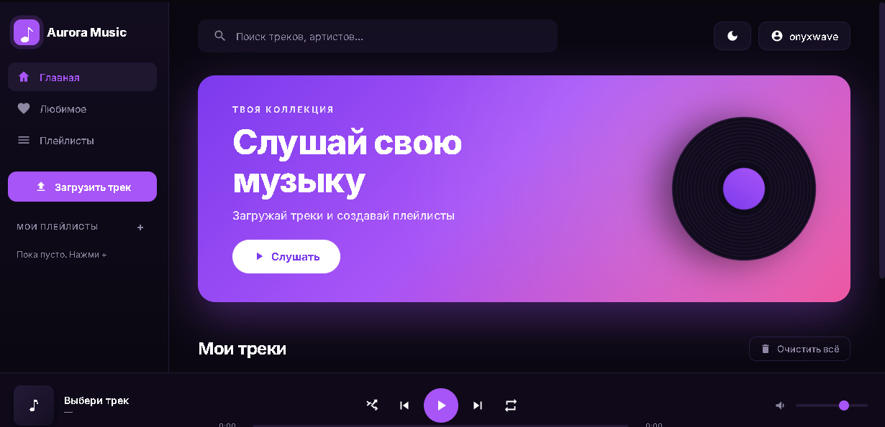

<div align="center">

# 🎵 Aurora Music

**Веб-музыкальный плеер в стиле Яндекс.Музыки — полностью в браузере, без сервера**

[](https://developer.mozilla.org/docs/Web/JavaScript)
[](https://developer.mozilla.org/docs/Web/HTML)
[](https://developer.mozilla.org/docs/Web/CSS)
[](LICENSE)

[Демо](https://onyxwork.github.io/aurora-music/) · [Возможности](#-возможности) · [Установка](#-быстрый-старт) · [Стек](#-технологии)

</div>

---

## 📖 О проекте

**Aurora Music** — это полнофункциональный музыкальный веб-плеер, который работает прямо в браузере. Никаких серверов, никаких баз данных — всё хранится локально на твоём устройстве через **IndexedDB** и **localStorage**.

Проект написан на **чистом JavaScript** без единого фреймворка — чтобы показать понимание основ веба: работу с DOM, асинхронность, Web Audio API, Canvas API и браузерными хранилищами.

## ✨ Возможности

| | Функция |
|---|---|
| 🎧 | **Загрузка треков** — mp3, wav, ogg, m4a, flac, aac, opus |
| 🖱 | **Drag & Drop** — перетащи файлы прямо в окно браузера |
| 🖼 | **Свои обложки** — загрузка фото с авто-подгонкой под 400×400 |
| 🎨 | **Авто-градиенты** — каждому треку свой цвет и эмодзи |
| 📁 | **Плейлисты** — создание, удаление, добавление треков |
| ❤️ | **Лайки** — избранное с сохранением |
| 👤 | **Авторизация** — регистрация и вход (локальные аккаунты) |
| 🌗 | **Тёмная / светлая тема** — переключатель в шапке |
| 🔍 | **Поиск** — по названию и исполнителю в реальном времени |
| ⌨️ | **Горячие клавиши** — Space, ←→, ↑↓ |
| 🎚 | **Плеер** — play/pause, next/prev, shuffle, repeat, громкость |
| ⏱ | **Прогресс-бар** — с перемоткой по клику |
| 💾 | **Автосохранение** — всё остаётся после перезагрузки |

## 🖼 Скриншоты

<div align="center">

### Главный экран


</div>

> _Замени картинки на свои скриншоты в папке `screenshots/`_

## 🚀 Быстрый старт

### 1. Клонируй репозиторий

```bash
git clone https://github.com/ТВОЙ_НИК/aurora-music.git
cd aurora-music
```

### 2. Запусти локальный сервер

Просто открыть `index.html` не получится — IndexedDB работает только через HTTP.

**Через Python:**
```bash
python -m http.server 8000
```

**Через Node.js:**
```bash
npx serve
```

**В VS Code:** установи расширение **Live Server** и нажми «Go Live».

### 3. Открой в браузере

```
http://localhost:8000
```

## 🎮 Как пользоваться

1. **Загрузи трек** — кнопка «Загрузить трек» в сайдбаре или перетащи mp3 в окно
2. **Настрой обложку** — нажми ✏️ рядом с треком и загрузи фото любого размера
3. **Создай аккаунт** — кнопка «Войти» справа сверху (для плейлистов)
4. **Собери плейлист** — нажми `+` в разделе «Мои плейлисты»
5. **Переключи тему** — кнопка 🌙/☀️ в шапке

## 🛠 Технологии

- **HTML5** — семантическая разметка
- **CSS3** — CSS-переменные, градиенты, анимации, grid/flexbox
- **Vanilla JavaScript (ES6+)** — без фреймворков
- **IndexedDB** — хранение аудиофайлов и обложек
- **localStorage** — метаданные, пользователи, плейлисты
- **Canvas API** — ресайз и кроп обложек
- **Web Audio API** — воспроизведение через `<audio>`
- **File API** — чтение загруженных файлов
- **DataTransfer API** — drag & drop

## 📐 Архитектура

```
aurora-music/
├── index.html          # Разметка: сайдбар, плеер, модалки
├── style.css           # Тёмная/светлая тема + все стили
├── script.js           # Логика: IndexedDB, плеер, авторизация
├── README.md
├── LICENSE
├── .gitignore
├── .gitattributes
└── .editorconfig
```

**Как хранятся данные:**

| Что | Где | Зачем |
|-----|-----|-------|
| Аудиофайлы (Blob) | IndexedDB (`audioFiles`) | Большие данные |
| Обложки (Blob) | IndexedDB (`coverImages`) | Большие данные |
| Метаданные треков | localStorage (`tracksMeta`) | Быстрый доступ |
| Пользователи | localStorage (`users`) | Простое хранилище |
| Плейлисты | localStorage (`playlists`) | Простое хранилище |
| Лайки | localStorage (`liked`) | Простое хранилище |
| Тема | localStorage (`theme`) | Настройка UI |

## ⌨️ Горячие клавиши

| Клавиша | Действие |
|---------|----------|
| `Space` | Play / Pause |
| `→` | Следующий трек |
| `←` | Предыдущий трек |
| `↑` | Громкость +5% |
| `↓` | Громкость −5% |

## ⚠️ Ограничения

- 🚫 Файлы хранятся **локально в браузере**, а не на сервере
- 🗑 При очистке кеша браузера треки удалятся
- 📱 На разных устройствах коллекция не синхронизируется
- 💾 Лимит IndexedDB ≈ 50–200 МБ в зависимости от браузера

> 💡 Хочешь настоящий сервер? В планах — Python-бэкенд на Flask с хранением файлов на диске.

## 🗺 Планы развития

- [ ] Python-бэкенд (Flask) для хранения файлов на сервере
- [ ] Чтение ID3-тегов из mp3 (автор, альбом, обложка)
- [ ] Визуализатор музыки на Web Audio API
- [ ] Синхронизация между устройствами
- [ ] PWA — установка на телефон
- [ ] Эквалайзер с пресетами
- [ ] Скачивание треков из плейлиста одним архивом

## 🤝 Вклад

Проект открыт для идей и предложений. Если хочешь что-то добавить — форкни репозиторий и открой Pull Request.

1. Fork
2. `git checkout -b feature/awesome-feature`
3. `git commit -m "Add awesome feature"`
4. `git push origin feature/awesome-feature`
5. Open Pull Request

## 📄 Лицензия

Распространяется под лицензией **MIT** — используй, изменяй, деплой куда хочешь.

См. [LICENSE](LICENSE).

## 👤 Автор

**Егор** — начинающий разработчик Python + Web

- GitHub: [@ТВОЙ_НИК](https://github.com/ТВОЙ_НИК)
- Telegram: [@ТВОЙ_ТЕЛЕГРАМ](https://t.me/ТВОЙ_ТЕЛЕГРАМ)

---

<div align="center">

**⭐ Поставь звезду, если проект понравился!**

Сделано с 💜 в 2026

</div>
